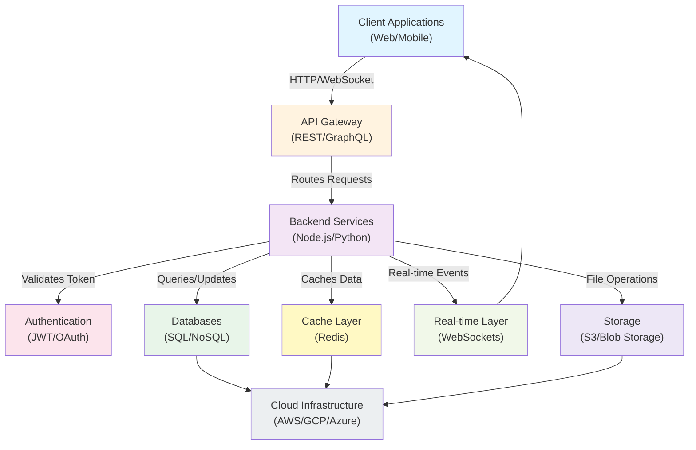
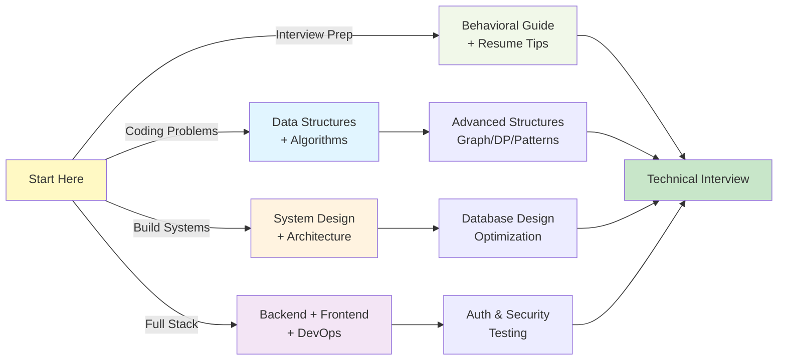

# 🎓 CS Prep Hub

Your comprehensive guide to software engineering mastery. Whether you're preparing for technical interviews, diving into competitive programming, or building distributed systems, we've got you covered.

From data structures and algorithms to system design and backend engineering—CS Prep Hub brings together everything you need to level up your skills.

---

## Learning Paths

### Algorithms & Data Structures

Build a rock-solid foundation in problem-solving techniques and data structures.

- **[Common Algorithms](/algos)**: Master standard algorithms you'll encounter in interviews
  - Graph Theory: BFS, DFS, Dijkstra, Topological Sort, Union-Find
  - Dynamic Programming: Knapsack, LCS, LIS, and more
  - Advanced Structures: Tries, Segment Trees
  - Specialized Techniques: Backtracking, Divide & Conquer, Sliding Window, Two Pointers, Greedy

- **[C++ STL Guide](/stl-guide)**: Deep dive into the Standard Template Library
  - Containers: Vectors, Maps, Sets, Priority Queues
  - Algorithms: Sorting, Searching, Manipulation
  - Perfect for competitive programming and performance-critical code

### System Design & Architecture

Learn to design systems that scale. From microservices to real-time applications, understand how the largest companies build their infrastructure.

- **[System Design](/system-design)**: Core architectural patterns and distributed system concepts
  - Scalability strategies: Vertical vs Horizontal scaling, Load Balancing
  - Caching layers and database optimization
  - CAP Theorem and consistency models

- **[API Design](/api-design)**: Build robust, maintainable APIs
  - RESTful principles and HTTP status codes
  - Real-world case studies (e.g., Spotify API)
  - Best practices for API versioning and error handling

- **[Database Fundamentals](/database-fundamentals)**: Master data persistence
  - Relational databases: SQL, ACID properties, normalization
  - NoSQL databases and when to use them
  - Indexing strategies and query optimization

- **[Cloud Native Development](/cloud-native-guide)**: Modern cloud architecture
  - Serverless computing with AWS Lambda
  - Container orchestration and S3 storage
  - Microservices patterns

- **[GraphQL](/graphql-guide)**: Next-generation API technology
  - Queries, Mutations, and Subscriptions
  - Apollo Server and comparison with REST
  - Real-time data synchronization

- **[Real-Time Systems](/real-time-guide)**: Build responsive, event-driven applications
  - WebSockets and Socket.io
  - Event-driven architecture patterns
  - Pub-Sub messaging

### Backend Engineering & DevOps

Master the skills needed for production-grade backend development.

- **[Backend Implementations](/backend-languages)**: Language comparison and best practices
  - Node.js/Express: Industry-standard JavaScript backend
  - Python/FastAPI: async, high-performance Python framework
  - When to choose which technology

- **[DevOps & CI/CD](/devops)**: Deploy with confidence
  - Docker containerization and deployment strategies
  - GitHub Actions for continuous integration
  - Infrastructure as Code concepts

- **[Authentication & Security](/auth-security)**: Protect your applications
  - JWT and OAuth 2.0 flows
  - HTTPS, CORS, and security headers
  - Comprehensive security checklist

- **[Testing & Quality Assurance](/testing-guide)**: Ensure reliability
  - Unit, Integration, and End-to-End testing
  - Test-Driven Development (TDD) methodology
  - Testing frameworks: Jest, PyTest, and more

### Programming Fundamentals

Strong foundations make everything else easier.

- **[Object-Oriented Programming](/oop-fundamentals)**: Design better software
  - The Four Pillars: Encapsulation, Inheritance, Polymorphism, Abstraction
  - Design Patterns: Singleton, Factory, Observer, Strategy, Adapter
  - SOLID Principles for maintainable code
  - Advanced topics: Lambda Expressions, Multithreading, Concurrency

- **[Frontend Fundamentals](/frontend-fundamentals)**: Build modern web interfaces
  - DOM manipulation and the Event Loop
  - CSS Layout: Flexbox and Grid
  - React Hooks and component design
  - State management patterns

### Interview Preparation

Land your dream role with interview-ready knowledge.

- **[Behavioral Interview Guide](/behavioral-guide)**: Excel in your interviews
  - STAR Method for behavioral questions
  - Common questions and how to answer them
  - Resume tips and portfolio building
  - Salary negotiation strategies

---

## System Architecture Overview

Here's how all these concepts connect in a real-world application:



---

## Learning Workflow

Choose your path based on your goals:



---

## Tech Stack

This resource is built with modern, reliable technologies:

- **Static Site Generator**: Jekyll - lightweight and blazing fast
- **Frontend**: HTML5, CSS3 with responsive design
- **JavaScript**: ES6+ for client-side interactivity
- **Features**:
  - Responsive navigation sidebar
  - Client-side search with pre-indexed content
  - Mobile-optimized responsive layout
  - Smooth page transitions with Barba.js
  - Dark mode support

Hosted on GitHub Pages with automatic deployments on every commit.

---

## Getting Started Locally

Want to run this project on your machine? It's straightforward:

1. Clone the repository:
   ```bash
   git clone https://github.com/sazid-zero/Study-MAT.git
   cd Study-MAT
   ```

2. Install Ruby dependencies:
   ```bash
   bundle install
   ```

3. Start the local development server:
   ```bash
   bundle exec jekyll serve
   ```

4. Open in your browser:
   Navigate to `http://localhost:4000/Study-MAT/`

The site will automatically rebuild as you make changes to the markdown files.

---

## Contributing

Have suggestions, corrections, or want to add new content? Contributions are welcome! Here are some ways you can help:

- Report errors or unclear explanations
- Suggest additional topics or algorithms
- Improve existing content with better examples
- Add new system design case studies

Feel free to open an issue or submit a pull request.

---

## Feedback & Contact

Found this resource helpful? Have questions or suggestions?

- Email: sharif.sazid.3@gmail.com
- GitHub: [@sazid-zero](https://github.com/sazid-zero)

---

## License

This project is open source and available under the [MIT License](LICENSE). Feel free to use this resource for learning, teaching, or any other purpose.
